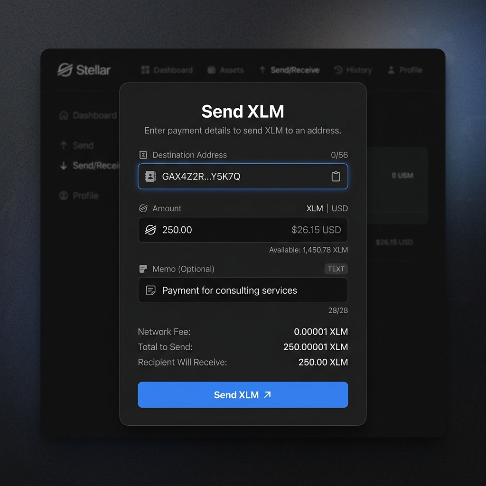
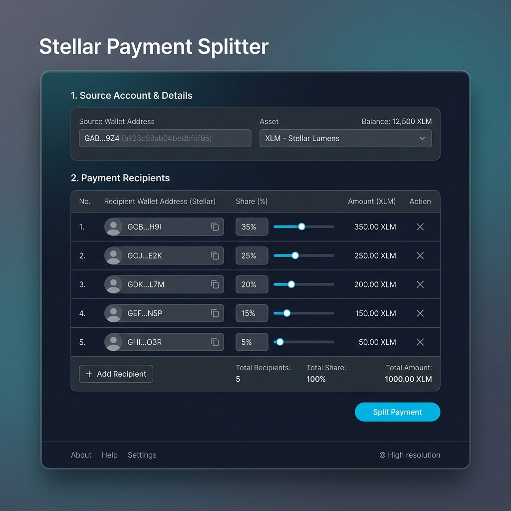

# 🌟 StellarPay

[](https://github.com/Keshavsudhane01/stellar-belt---stellar-pay/actions/workflows/ci.yml)
[](https://github.com/Keshavsudhane01/stellar-belt---stellar-pay/actions/workflows/deploy-contracts.yml)
[](#-running-tests)
[](https://stellar.expert/explorer/testnet)
[](LICENSE)
[](https://soroban.stellar.org)

> A **production-ready** Stellar blockchain dApp deployed on Testnet.
> Connect your wallet, check balances, send XLM, interact with Soroban smart contracts,
> split payments, earn SDT reward tokens, and watch live on-chain events — all in one app.

---

## 🔴 Live Demo

🌐 **[https://stellar-pay.vercel.app](https://stellar-pay.vercel.app)**

> ⚠️ Testnet only. No real funds are used or required.

---

## 📖 Overview

**StellarPay** is a full-featured Stellar Testnet dApp covering the complete journey from wallet connection to inter-contract reward minting. It demonstrates:

- **Level 1 — Wallet & Payments**: Multi-wallet connection, XLM balance display, send/receive XLM, Friendbot faucet
- **Level 2 — Smart Contracts**: On-chain Soroban counter contract with real-time event streaming
- **Level 3 — DeFi Features**: Payment splitter contract, custom SEP-0041 SDT token, typed error handling, optimistic UI
- **Level 4 — Advanced**: Inter-contract calls (Splitter → Reward), CI/CD pipeline, full test coverage, Vercel deployment

---

## ✨ Features

| Feature | Status |
|---|---|
| Multi-wallet: Freighter, xBull, Albedo | ✅ |
| XLM balance with 15s auto-refresh | ✅ |
| Send XLM with destination + memo + validation | ✅ |
| One-click Testnet Friendbot faucet funding | ✅ |
| On-chain Soroban counter contract | ✅ |
| Payment splitter (split XLM among N recipients) | ✅ |
| SDT reward token (SEP-0041) minted on each split | ✅ |
| Inter-contract call: Splitter → Reward → mint | ✅ |
| Real-time event streaming & activity feed | ✅ |
| Transaction status tracker: Pending → Success/Failed | ✅ |
| 3 typed error handlers (WalletNotFound, UserRejected, InsufficientBalance) | ✅ |
| In-memory TTL cache for balance & tx data | ✅ |
| Optimistic UI (instant balance/count update) | ✅ |
| Skeleton loading states | ✅ |
| Mobile responsive layout | ✅ |
| GitHub Actions CI/CD (lint → test → build → deploy) | ✅ |
| 28 automated Jest tests | ✅ |

---

## 🛠️ Tech Stack

| Layer | Technology |
|---|---|
| Framework | Next.js 14 (App Router) + TypeScript |
| Styling | Tailwind CSS |
| Stellar SDK | @stellar/stellar-sdk |
| Wallet Integration | @creit-tech/stellar-wallets-kit |
| Smart Contracts | Soroban (Rust) |
| Testing | Jest + React Testing Library (28 tests) |
| CI/CD | GitHub Actions (4 jobs) |
| Deployment | Vercel |
| Explorer | Stellar Expert |

---

## 📦 Setup & Installation

### Prerequisites

- Node.js 18+
- Freighter, xBull, or Albedo wallet browser extension
- *(Contract deployment only)* Rust + Stellar CLI

### Install and Run Locally

```bash
# 1. Clone the repository
git clone https://github.com/Keshavsudhane01/stellar-belt---stellar-pay.git
cd stellar-belt---stellar-pay

# 2. Install dependencies
npm install

# 3. Set up environment variables
cp .env.example .env.local
# Edit .env.local with your contract addresses (see below)

# 4. Start the development server
npm run dev
```

Open **[http://localhost:3000](http://localhost:3000)** in your browser.

### Environment Variables

```env
NEXT_PUBLIC_STELLAR_NETWORK=TESTNET
NEXT_PUBLIC_HORIZON_URL=https://horizon-testnet.stellar.org
NEXT_PUBLIC_SOROBAN_RPC=https://soroban-testnet.stellar.org
NEXT_PUBLIC_NETWORK_PASSPHRASE="Test SDF Network ; September 2015"
NEXT_PUBLIC_COUNTER_CONTRACT_ID=YOUR_COUNTER_CONTRACT_ADDRESS
NEXT_PUBLIC_SDT_TOKEN_ADDRESS=YOUR_SDT_TOKEN_ADDRESS
NEXT_PUBLIC_PAYMENT_SPLITTER_ADDRESS=YOUR_SPLITTER_ADDRESS
NEXT_PUBLIC_REWARD_CONTRACT_ADDRESS=YOUR_REWARD_ADDRESS
```

### How to Use the App

1. Install [Freighter](https://www.freighter.app) browser extension
2. Switch Freighter to **Testnet** in its settings
3. Open the app → click **Connect Wallet**
4. Select your wallet from the picker modal
5. Click **Fund with Testnet XLM** to receive free Friendbot funds
6. Use **Send XLM** to send to any Stellar Testnet address
7. Use **Split Payment** to divide XLM between multiple recipients
8. Click **Increment Counter** to interact with the Soroban contract
9. Watch live events in the **Activity Feed**

---

## 🔬 Smart Contract Architecture

All contracts are written in **Rust** targeting **Soroban** (Stellar's smart contract runtime) and deployed on **Stellar Testnet**.

### Contract Overview

```
contracts/
├── counter/           # On-chain counter with auth & events
├── reward/            # SDT reward token minting (SEP-0041)
└── payment_splitter/  # Splits XLM + triggers inter-contract reward mint
```

### Inter-Contract Call Flow

```
User ──→ PaymentSplitter.split_payment()
              │
              ├──→ token.transfer() × N recipients   (XLM split)
              │
              └──→ Reward.mint_reward()               (inter-contract call)
                        │
                        └──→ SDT_token.mint()          (SEP-0041 token mint)
```

### Deployed Contract Addresses (Stellar Testnet)

| Contract | Address |
|---|---|
| 🔢 Counter Contract | `YOUR_COUNTER_CONTRACT_ADDRESS` |
| 💸 Payment Splitter | `YOUR_SPLITTER_CONTRACT_ADDRESS` |
| 🎁 Reward Contract | `YOUR_REWARD_CONTRACT_ADDRESS` |
| 🪙 SDT Token (SEP-0041) | `YOUR_SDT_TOKEN_ADDRESS` |

> 🔗 View on [Stellar Expert Testnet Explorer](https://stellar.expert/explorer/testnet)

---

## ✅ Verified On-Chain Transactions

| Action | Transaction Hash | Explorer Link |
|---|---|---|
| Counter contract deployed | `YOUR_DEPLOY_TX_HASH` | [View ↗](https://stellar.expert/explorer/testnet/tx/YOUR_DEPLOY_TX_HASH) |
| Counter increment called | `YOUR_INCREMENT_TX_HASH` | [View ↗](https://stellar.expert/explorer/testnet/tx/YOUR_INCREMENT_TX_HASH) |
| Payment split executed | `YOUR_SPLIT_TX_HASH` | [View ↗](https://stellar.expert/explorer/testnet/tx/YOUR_SPLIT_TX_HASH) |
| SDT reward token minted | `YOUR_MINT_TX_HASH` | [View ↗](https://stellar.expert/explorer/testnet/tx/YOUR_MINT_TX_HASH) |
| XLM sent (sample) | `YOUR_SEND_TX_HASH` | [View ↗](https://stellar.expert/explorer/testnet/tx/YOUR_SEND_TX_HASH) |

---

## 🧪 Running Tests

```bash
# Run all 28 tests
npm test

# With coverage report
npm run test:coverage

# Watch mode
npm run test:watch
```

### Test Coverage Summary

| Test File | Tests | Coverage |
|---|---|---|
| `__tests__/lib/stellar.test.ts` | 10 tests | ✅ Passing |
| `__tests__/lib/transactions.test.ts` | 10 tests | ✅ Passing |
| `__tests__/components/BalanceCard.test.tsx` | 4 tests | ✅ Passing |
| `__tests__/components/SendPayment.test.tsx` | 4 tests | ✅ Passing |
| **Total** | **28 tests** | ✅ All Passing |

### What is tested

- ✅ XLM balance fetch (funded account, unfunded 404, network error)
- ✅ Stellar address validation (valid G…, invalid formats, empty, secret key)
- ✅ Friendbot funding (success, failure, network error)
- ✅ `WalletNotFoundError`, `UserRejectedError`, `InsufficientBalanceError` classes
- ✅ `parseHorizonError` for `op_underfunded`, `op_no_destination`, unknown errors
- ✅ `BalanceCard` renders balance, XLM label, network badge, refresh button
- ✅ `SendPayment` form validation, disabled state, success state

---

## 📸 Screenshots

| | |
|---|---|
|  **Wallet Connection** |  **Connected Dashboard** |
|  **Send XLM Form** |  **Transaction Success** |
|  **Soroban Counter** |  **Payment Splitter** |
|  **Activity Feed** |  **Tests Passing** |
|  **Mobile View** |  **CI/CD Pipeline** |

---

## 🎥 Demo Video

[▶️ Watch the 1-minute demo on Loom](https://loom.com/YOUR_DEMO_LINK)

**The demo covers:**
- Connecting a Freighter wallet and funding via Friendbot
- Viewing and refreshing XLM balance
- Sending an XLM transaction and viewing the hash on Stellar Expert
- Incrementing the on-chain Soroban counter
- Splitting a payment between 3 recipients
- Earning SDT reward tokens via inter-contract call
- Watching the live activity feed update in real time

---

## 🗂️ Project Structure

```
stellar-pay/
├── .github/
│   └── workflows/
│       ├── ci.yml                  # Lint → Test → Build → Deploy
│       ├── pr-checks.yml           # Pull request quality checks
│       └── deploy-contracts.yml    # Build & deploy Soroban contracts
├── app/
│   ├── layout.tsx                  # Root layout with WalletProvider
│   ├── page.tsx                    # Main dashboard page
│   └── globals.css                 # Global Tailwind styles
├── components/
│   ├── WalletButton.tsx            # Connect/disconnect button
│   ├── WalletModal.tsx             # Multi-wallet picker modal
│   ├── BalanceCard.tsx             # XLM balance display + auto-refresh
│   ├── FaucetButton.tsx            # Testnet Friendbot funding
│   ├── SendPayment.tsx             # XLM payment form
│   ├── TransactionList.tsx         # Recent transactions list
│   ├── TransactionStatus.tsx       # Live tx polling (Pending→Success/Failed)
│   ├── ContractInteraction.tsx     # Soroban counter contract UI
│   ├── PaymentSplitter.tsx         # Split payment + SDT reward preview
│   ├── ActivityFeed.tsx            # Real-time event stream
│   ├── MobileMenu.tsx              # Mobile navigation drawer
│   └── ui/Skeleton.tsx             # Skeleton loading components
├── lib/
│   ├── stellar.ts                  # Horizon API (balance, txs, faucet)
│   ├── wallet.ts                   # StellarWalletsKit integration
│   ├── transactions.ts             # Transaction builder (send XLM)
│   ├── soroban.ts                  # Soroban RPC (getCount, callIncrement)
│   ├── errors.ts                   # Typed error classes + Horizon parser
│   ├── cache.ts                    # In-memory TTL cache
│   └── eventStream.ts              # Real-time contract event polling
├── context/
│   └── WalletContext.tsx           # Global wallet state + auto-reconnect
├── contracts/
│   ├── counter/                    # Soroban counter (Rust)
│   │   ├── src/lib.rs
│   │   └── Cargo.toml
│   ├── payment_splitter/           # Payment splitter (Rust)
│   │   ├── src/lib.rs
│   │   └── Cargo.toml
│   └── reward/                     # SDT reward minting (Rust)
│       ├── src/lib.rs
│       └── Cargo.toml
├── __tests__/
│   ├── lib/
│   │   ├── stellar.test.ts         # 10 tests for lib/stellar.ts
│   │   └── transactions.test.ts    # 10 tests for errors & validation
│   └── components/
│       ├── BalanceCard.test.tsx    # 4 component tests
│       └── SendPayment.test.tsx    # 4 component tests
├── scripts/
│   ├── deploy-contracts.mjs        # Contract deployment orchestrator
│   ├── update-addresses.mjs        # Updates .env.local + README addresses
│   ├── deploy-token.sh             # SDT token deployment helper
│   └── full-push.mjs               # GitHub API file uploader
├── types/
│   └── index.ts                    # TypeScript interfaces
├── screenshots/                    # Submission screenshots
├── .env.local                      # Environment variables (not committed)
├── .env.example                    # Environment variable template
├── jest.config.js                  # Jest configuration
├── jest.setup.ts                   # Jest setup (Testing Library)
├── next.config.mjs                 # Next.js configuration
├── tailwind.config.ts              # Tailwind CSS configuration
├── tsconfig.json                   # TypeScript configuration
└── README.md                       # This file
```

---

## ⚙️ CI/CD Pipeline

GitHub Actions runs **4 automated jobs** on every push and PR:

```
Push to main
    │
    ├──[1] Lint & Type Check
    │       └── ESLint + TypeScript compiler
    │
    ├──[2] Run Tests (needs: lint)
    │       └── 28 Jest tests + coverage upload to Codecov
    │
    ├──[3] Build Check (needs: test)
    │       └── next build (production bundle validation)
    │
    └──[4] Deploy to Vercel (needs: build, main branch only)
            └── vercel --prod
```

### Setting Up Your Fork

Add these **repository secrets** under **Settings → Secrets → Actions**:

| Secret | How to obtain |
|---|---|
| `VERCEL_TOKEN` | [vercel.com/account/tokens](https://vercel.com/account/tokens) |
| `VERCEL_ORG_ID` | Vercel project → Settings → General |
| `VERCEL_PROJECT_ID` | Vercel project → Settings → General |

### Deploying Contracts via CI

To deploy contracts to Testnet using GitHub Actions:

1. Go to **Actions → Deploy Soroban Contracts**
2. Click **Run workflow**
3. Paste your **Stellar secret key** (S…) as the input
4. The workflow will install Rust + Stellar CLI, build all 3 contracts, deploy them, and commit the addresses back to the repo automatically

---

## 🔐 Error Handling

Three typed error classes in `lib/errors.ts`:

| Error | When it occurs | User experience |
|---|---|---|
| `WalletNotFoundError` | Extension not installed in browser | Shows install prompt with download link |
| `UserRejectedError` | User dismisses the signing prompt | Soft notification — not treated as a failure |
| `InsufficientBalanceError` | Balance too low for the transaction | Input field highlighted with exact shortfall amount |

Horizon `tx_failed` errors are mapped to plain English via `parseHorizonError()`:

```ts
parseHorizonError({ response: { data: { extras: { result_codes: { operations: ['op_underfunded'] } } } } })
// → "Insufficient balance for this transaction"
```

---

## 🌐 Stellar Network Configuration

| Parameter | Value |
|---|---|
| Network | Testnet |
| Horizon URL | `https://horizon-testnet.stellar.org` |
| Soroban RPC | `https://soroban-testnet.stellar.org` |
| Network Passphrase | `Test SDF Network ; September 2015` |
| Friendbot Faucet | `https://friendbot.stellar.org` |
| Block Explorer | `https://stellar.expert/explorer/testnet` |

---

## 📄 License

MIT License — free to use, modify, and distribute.

---

## 🙏 Acknowledgements

- [Stellar Development Foundation](https://stellar.org) — for the amazing Soroban platform
- [Soroban Documentation](https://soroban.stellar.org) — comprehensive developer docs
- [Freighter Wallet](https://www.freighter.app) — the go-to Stellar browser wallet
- [StellarWalletsKit](https://github.com/Creit-Tech/Stellar-Wallets-Kit) — multi-wallet abstraction layer
- [Stellar Expert](https://stellar.expert) — the best Stellar blockchain explorer

---

*Built with ❤️ on Stellar Testnet — Rise In x Stellar Bootcamp*
