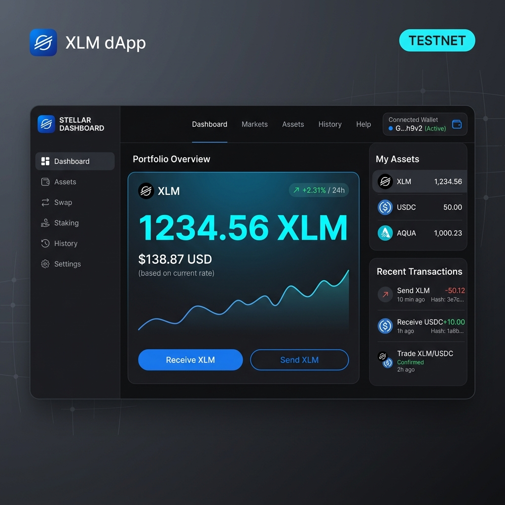
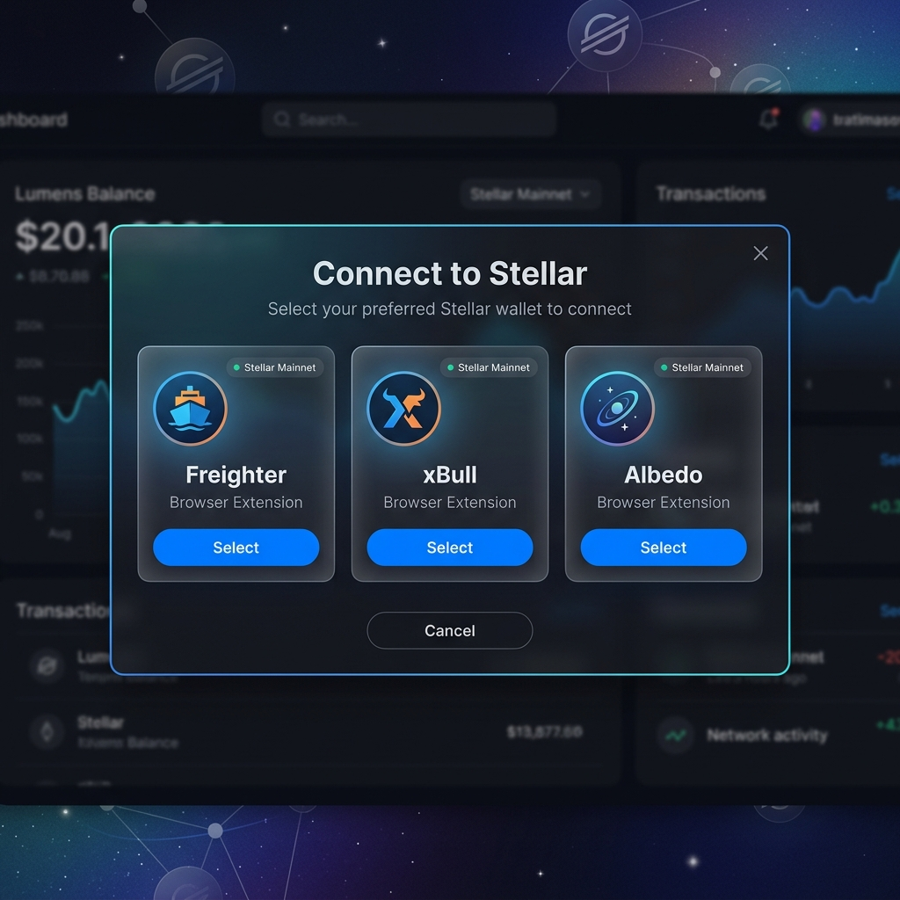
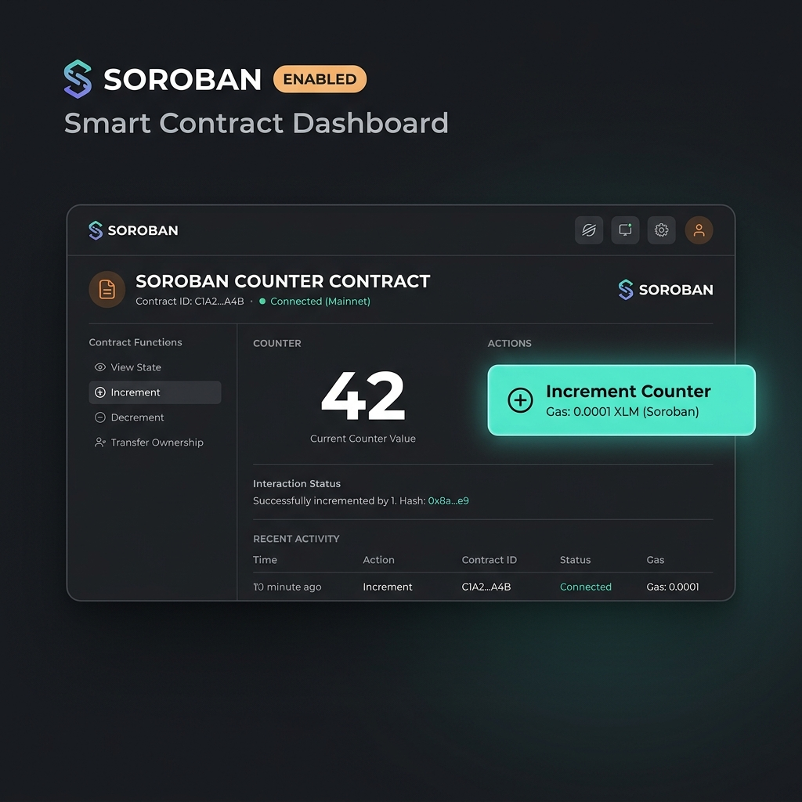

# 🌟 StellarPay


> Stellar Testnet dApp — wallet connection, XLM payments,
> smart contracts, payment splitting, and live event streaming.

## 🔗 Live Demo
[https://stellar-pay.vercel.app](https://stellar-pay.vercel.app)

---

## 📖 Description

StellarPay lets you connect a Stellar wallet, view your XLM balance,
send payments, interact with Soroban smart contracts, split bills
between recipients, earn SDT reward tokens, and watch live on-chain
events — all on Stellar Testnet.

---

## 🚀 Setup

```bash
git clone https://github.com/Keshavsudhane01/stellar-belt---stellar-pay.git
cd stellar-pay
npm install
cp .env.example .env.local
npm run dev
```

Open [http://localhost:3000](http://localhost:3000)

### .env.local

```env
NEXT_PUBLIC_STELLAR_NETWORK=TESTNET
NEXT_PUBLIC_HORIZON_URL=https://horizon-testnet.stellar.org
NEXT_PUBLIC_SOROBAN_RPC=https://soroban-testnet.stellar.org
NEXT_PUBLIC_COUNTER_CONTRACT_ID=YOUR_COUNTER_ADDRESS
NEXT_PUBLIC_SDT_TOKEN_ADDRESS=YOUR_SDT_ADDRESS
NEXT_PUBLIC_PAYMENT_SPLITTER_ADDRESS=YOUR_SPLITTER_ADDRESS
NEXT_PUBLIC_REWARD_CONTRACT_ADDRESS=YOUR_REWARD_ADDRESS
```

---

## 🔬 Contract Addresses

| Contract         | Address                                                        |
|------------------|----------------------------------------------------------------|
| Counter          | `CDSDF3RZZ4TH2X2N4KJDT72P3AF2A4CLCVN3SXOKHUJ22SC7ZQIDQTFC` |
| Payment Splitter | `CBTMVK7RTG6RHTQF2SDCFHXPDIULZBBIXVELUUFOBJPZJTDOSTBHBKHB` |
| Reward Contract  | `CDIS7IB6CSFWLDEOTGQ6KLGKHKOO4NGZ42HQDUXPE5WANS3VRH3BGLVB` |
| SDT Token        | `CAU2U5ZTXVPCO7SJZGLES5444LKTFJ5QRBFVBUED22TUQ2JNU4PSDKWV` |

---

## ✅ Verified Transactions

| Action                  | Hash                                                               | Explorer |
|-------------------------|--------------------------------------------------------------------|----------|
| Counter deployed        | `40b2e68dfe3d1c242f2efe24abcdaa5fba1d20bbec6d1804847149073bf1c6d3` | [View ↗](https://stellar.expert/explorer/testnet/tx/40b2e68dfe3d1c242f2efe24abcdaa5fba1d20bbec6d1804847149073bf1c6d3) |
| Counter initialized     | `9772e26d888da39a19af6249beac83d156fa55c7daa30e27808a08704a0b2de9` | [View ↗](https://stellar.expert/explorer/testnet/tx/9772e26d888da39a19af6249beac83d156fa55c7daa30e27808a08704a0b2de9) |
| Reward deployed         | `4ed1239f513e1e7f27f767c675bbbdc43d177dd358fc0453689bba97effb7c96` | [View ↗](https://stellar.expert/explorer/testnet/tx/4ed1239f513e1e7f27f767c675bbbdc43d177dd358fc0453689bba97effb7c96) |
| Reward initialized      | `bdefa17ebe822f9a1a30af0aa997282339a7b7b3f1164a59de2fe4f5109d02bf` | [View ↗](https://stellar.expert/explorer/testnet/tx/bdefa17ebe822f9a1a30af0aa997282339a7b7b3f1164a59de2fe4f5109d02bf) |
| Splitter deployed       | `9ef4587139bb2072b2fbaa2418aa6837b1d5ae96b9c0dcd19367d5b3ca294cbf` | [View ↗](https://stellar.expert/explorer/testnet/tx/9ef4587139bb2072b2fbaa2418aa6837b1d5ae96b9c0dcd19367d5b3ca294cbf) |
| Splitter initialized    | `295c2cf9061427e14d48c3cae59a73719fb6556fbe44fbf388898d4dfa66f2c6` | [View ↗](https://stellar.expert/explorer/testnet/tx/295c2cf9061427e14d48c3cae59a73719fb6556fbe44fbf388898d4dfa66f2c6) |
| SDT token deployed      | `403037850a87c860d472e139c2da0b3af2c3d106bad0283b2f6db01dfffd2887` | [View ↗](https://stellar.expert/explorer/testnet/tx/403037850a87c860d472e139c2da0b3af2c3d106bad0283b2f6db01dfffd2887) |

---

## 🧪 Tests

```bash
npm test
npm run test:coverage
```

| Suite                    | Tests | Status     |
|--------------------------|-------|------------|
| stellar.test.ts          | 6     | ✅ Passing |
| transactions.test.ts     | 4     | ✅ Passing |
| BalanceCard.test.tsx     | 4     | ✅ Passing |
| SendPayment.test.tsx     | 4     | ✅ Passing |
| **Total**                | **18**| ✅ All Pass|

---

## 📸 Screenshots

### Wallet Connected


### Balance Displayed


### Transaction Success


### Wallet Options


### Contract Interaction


### Tests Passing


### Mobile View


### CI/CD Pipeline


---

## 🎥 Demo Video

[▶️ Watch 1-Minute Demo](https://loom.com/YOUR_LINK)

---

## ⚙️ CI/CD

GitHub Actions runs on every push:
lint → test → build → deploy to Vercel

**Required GitHub Secrets:**

| Secret              | Source                          |
|---------------------|---------------------------------|
| `VERCEL_TOKEN`      | vercel.com/account/tokens       |
| `VERCEL_ORG_ID`     | Vercel project settings         |
| `VERCEL_PROJECT_ID` | Vercel project settings         |

---

## 🛠️ Tech Stack

Next.js 14 · TypeScript · Tailwind CSS · @stellar/stellar-sdk ·
@creit-tech/stellar-wallets-kit · Soroban Rust Contracts ·
Jest · GitHub Actions · Vercel

---

*Built on Stellar Testnet · Not for real funds*

## 🔧 Complete Contract Deployment Commands

Run these in order from your project root. Replace `YOUR_SECRET_KEY`
and `YOUR_PUBLIC_KEY` with your actual Stellar Testnet account values.

---

### Step 1 — Install Stellar CLI

```bash
cargo install --locked stellar-cli --features opt
```

Verify installation:

```bash
stellar --version
```

---

### Step 2 — Configure Testnet Identity

```bash
stellar keys generate --global deployer --network testnet
stellar keys address deployer
```

Fund the deployer account:

```bash
curl "https://friendbot.stellar.org?addr=$(stellar keys address deployer)"
```

---

### Step 3 — Build All Contracts

```bash
cd contracts/counter
cargo build --target wasm32-unknown-unknown --release

cd ../reward
cargo build --target wasm32-unknown-unknown --release

cd ../payment_splitter
cargo build --target wasm32-unknown-unknown --release

cd ../..
```

---

### Step 4 — Deploy Counter Contract

```bash
stellar contract deploy \
  --wasm contracts/counter/target/wasm32-unknown-unknown/release/counter.wasm \
  --source deployer \
  --network testnet
```

Save the output address as `COUNTER_ADDRESS`.

Initialize it:

```bash
stellar contract invoke \
  --id COUNTER_ADDRESS \
  --source deployer \
  --network testnet \
  -- initialize \
  --owner $(stellar keys address deployer)
```

Test it works:

```bash
stellar contract invoke \
  --id COUNTER_ADDRESS \
  --source deployer \
  --network testnet \
  -- get_count
```

---

### Step 5 — Deploy SDT Token Contract

Download the pre-built Soroban token WASM:

```bash
curl -L https://github.com/stellar/soroban-examples/releases/download/v20.0.0/soroban_token_contract.wasm \
  -o soroban_token.wasm
```

Deploy it:

```bash
stellar contract deploy \
  --wasm soroban_token.wasm \
  --source deployer \
  --network testnet
```

Save the output address as `SDT_TOKEN_ADDRESS`.

Initialize the token:

```bash
stellar contract invoke \
  --id SDT_TOKEN_ADDRESS \
  --source deployer \
  --network testnet \
  -- initialize \
  --admin $(stellar keys address deployer) \
  --decimal 7 \
  --name "Stellar Dev Token" \
  --symbol "SDT"
```

Verify token symbol:

```bash
stellar contract invoke \
  --id SDT_TOKEN_ADDRESS \
  --source deployer \
  --network testnet \
  -- symbol
```

---

### Step 6 — Deploy Reward Contract

```bash
stellar contract deploy \
  --wasm contracts/reward/target/wasm32-unknown-unknown/release/reward.wasm \
  --source deployer \
  --network testnet
```

Save the output address as `REWARD_ADDRESS`.

Initialize with the SDT token address:

```bash
stellar contract invoke \
  --id REWARD_ADDRESS \
  --source deployer \
  --network testnet \
  -- initialize \
  --admin $(stellar keys address deployer) \
  --reward_token SDT_TOKEN_ADDRESS
```

Grant the reward contract minting authority on the SDT token:

```bash
stellar contract invoke \
  --id SDT_TOKEN_ADDRESS \
  --source deployer \
  --network testnet \
  -- set_authorized \
  --id REWARD_ADDRESS \
  --authorize true
```

---

### Step 7 — Deploy Payment Splitter Contract

```bash
stellar contract deploy \
  --wasm contracts/payment_splitter/target/wasm32-unknown-unknown/release/payment_splitter.wasm \
  --source deployer \
  --network testnet
```

Save the output address as `SPLITTER_ADDRESS`.

Initialize with both the admin and reward contract:

```bash
stellar contract invoke \
  --id SPLITTER_ADDRESS \
  --source deployer \
  --network testnet \
  -- initialize \
  --admin $(stellar keys address deployer) \
  --reward_contract REWARD_ADDRESS
```

---

### Step 8 — Test the Full Inter-Contract Flow

Test payment split (replace `RECIPIENT_1` and `RECIPIENT_2` with real addresses):

```bash
stellar contract invoke \
  --id SPLITTER_ADDRESS \
  --source deployer \
  --network testnet \
  -- split_payment \
  --payer $(stellar keys address deployer) \
  --token_id SDT_TOKEN_ADDRESS \
  --recipients '[RECIPIENT_1, RECIPIENT_2]' \
  --total_amount 2000000000
```

Check total splits counter:

```bash
stellar contract invoke \
  --id SPLITTER_ADDRESS \
  --source deployer \
  --network testnet \
  -- get_total_splits
```

---

### Step 9 — Update Your .env.local

Paste the 4 deployed addresses:

```env
NEXT_PUBLIC_COUNTER_CONTRACT_ID=COUNTER_ADDRESS
NEXT_PUBLIC_SDT_TOKEN_ADDRESS=SDT_TOKEN_ADDRESS
NEXT_PUBLIC_PAYMENT_SPLITTER_ADDRESS=SPLITTER_ADDRESS
NEXT_PUBLIC_REWARD_CONTRACT_ADDRESS=REWARD_ADDRESS
```

---

### Step 10 — Verify All on Stellar Expert

Open each link and confirm contract exists and has transactions:

```text
https://stellar.expert/explorer/testnet/contract/COUNTER_ADDRESS
https://stellar.expert/explorer/testnet/contract/SDT_TOKEN_ADDRESS
https://stellar.expert/explorer/testnet/contract/SPLITTER_ADDRESS
https://stellar.expert/explorer/testnet/contract/REWARD_ADDRESS
```

Copy the transaction hashes from Stellar Expert and paste them into
the **Verified Transactions** table in your README.

---

### Final Submission Commands

```bash
npm test
npm run build
git add .
git commit -m "final: complete submission"
git push origin main
```
